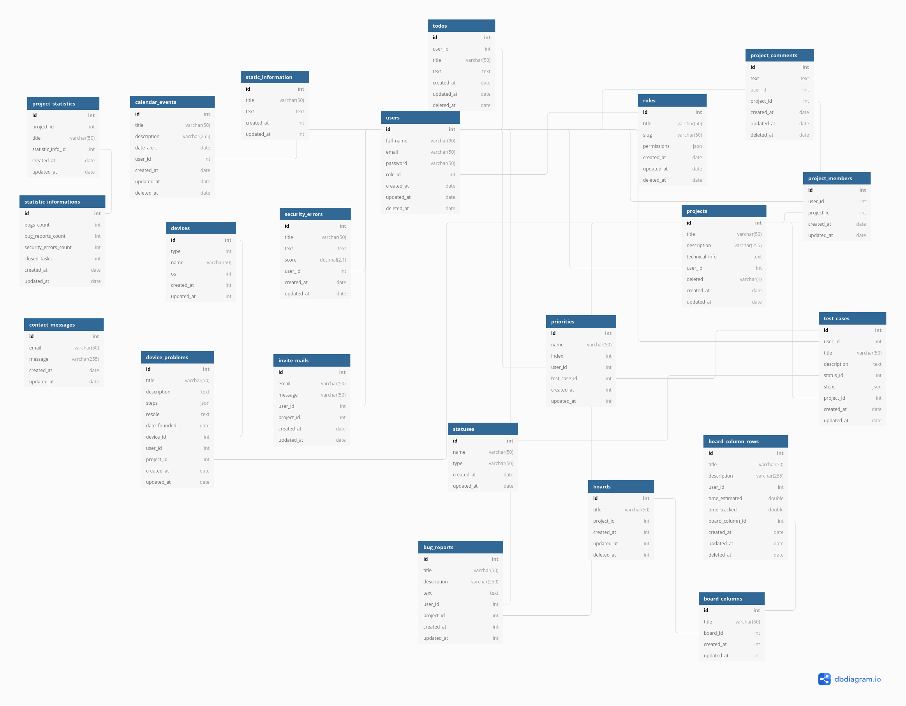

# OpenQR (open qa resource ) open-source solution for manage qa resources test-cases, bug-reports, security-errors, team

## Based on AdonisJS framework

## ER diagram



### For start up the project

Run the following command to run docker

```bash
sudo docker-compose up
```

### Migrations

Run the following command to run startup migrations.

Step 1

```bash
sudo docker exec -it app /bin/bash
```

Step 2

```js
adonis migration:run
```

### Seeds

Run the following command to run startup migrations.

Step 1

```bash
sudo docker exec -it app /bin/bash
```

Step 2

```js
adonis seed
```

### Open in browser link

[Open a OpenQR](http://0.0.0.0:8080/)
